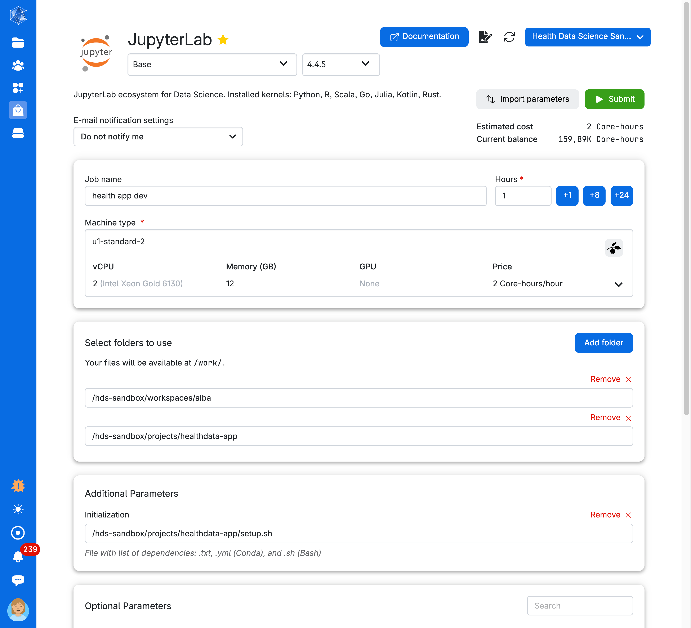

# Development health data sandbox

This project consists of two repositories:

- This repository: Contains all the course materials (notebooks, scripts) for the webpage and the app.
- healthdata_app (private): contains the Dockerfile and environment files needed by UCloud IT staff to deploy the app on their system.

## How to Work on the Course Materials

1. Clone this repository.
2. Start working on the materials. Since multiple people may be collaborating, please communicate regularly and push your changes often to avoid conflicts.
3. After you have cloned the repo to UCloud or any other system, **always run `git pull`** before starting work to fetch any updates others may have pushed. This helps prevent merge conflicts.

## Submitting Jobs on UCloud

Using the **Health Data Science Sandbox workspace** on UCloud for development and testing.

Below is a screenshot showing how to submit a job using the environment (currently located in `hds-sandbox/projects/healthdata` on UCloud) along with the location of my cloned repository on UCloud — you should use your own clone.

As you can see, there are two folders mounted from the hds-sandbox drive. You also need to run the initialization bash script setup.sh to ensure the Pixi environment is activated when you launch JupyterLab.

Tip: If the environment isn’t active, double-check that you’ve mounted the correct folder—not a parent directory—since the paths will differ if you mount the top-level directory.

## Environment Management

For managing software environments in this app, we use [Pixi](https://pixi.sh/dev/getting_started/), a lightweight and flexible environment manager. Make sure to run the `setup.sh` script before launching JupyterLab or submitting jobs to to activate the Pixi environment properly.

As a sandbox member, you can modify the environment, so please be cautious as changes will affect everyone’s setup. If you want to test or experiment, consider installing Pixi environments in a separate directory (copy pixi.toml and run pixi install). That said, all software required for the courses must be installed within hds-sandbox/project/healthdata-app so that the environment’s toml file stays up to date and consistent for all users.